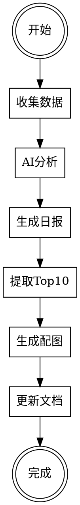

# AI Hotspot Daily Report

## Overview

完整的AI热点日报生成流程，包括数据收集、AI分析、Obsidian文档生成、Top 10提取和专业配图生成。

**核心原则**: 这是一个**自动化工作流**，不是写作任务。使用现有脚本，不要手动创建内容。

**CRITICAL**: This is an AUTOMATION workflow. You MUST run existing Python scripts. Do NOT write content manually.

## Red Flags - STOP If You're Doing These

These thoughts mean you're violating the workflow:

| ❌ Wrong Approach | ✅ Correct Approach |
|-------------------|---------------------|
| "I'll write professional content manually" | Run `python3 main.py` to collect real data |
| "I'll create image prompts" | Run `generate_enhanced_top10.py` to generate actual images |
| "Let me research AI trends and summarize" | Use Claude API automation, don't manually research |
| "I'll improve the document structure" | Use established format: `YYYY-MM-DD.md` + `Top10总结.md` |
| "I can skip the virtual environment" | **REQUIRED**: `source venv/bin/activate` first |
| "General knowledge about AI is enough" | Value is in REAL Reddit/YouTube data, not invented content |
| "Creating prompts is good enough" | Must generate actual JPG files with ModelScope API |

**All of these mean: Stop. Follow the Quick Reference workflow below.**

## When to Use

使用此skill当：
- ✅ 需要生成每日AI热点报告
- ✅ 需要从Reddit、YouTube等多源收集AI相关内容
- ✅ 需要使用Claude AI进行智能分析和摘要
- ✅ 需要生成Obsidian格式的结构化文档
- ✅ 需要为Top 10热点生成专业配图
- ✅ 需要基于Intelligent Prompt Generator原则生成图片

不要使用当：
- ❌ 只需简单的数据收集（使用基础爬虫）
- ❌ 不需要AI分析（使用简单汇总工具）
- ❌ 不需要可视化内容（只需文字报告）

## Quick Reference - FOLLOW THIS EXACTLY

**DO NOT SKIP THESE STEPS. DO NOT IMPROVISE.**

| Step | Command (Run Exactly) | Expected Output | Duration |
|------|----------------------|-----------------|----------|
| 0. **Activate venv** | `cd /Users/zhuyansen/Project/AiWriting/ai-hotspot-collector && source venv/bin/activate` | `(venv)` in prompt | 1 sec |
| 1. **Collect Data** | `python3 main.py --hours 24` | `2026-01-15.md` (~4000 lines, 241 items) | ~5 min |
| 2. **Generate Images** | `python3 generate_enhanced_top10.py` | 10 JPG files in `images/2026-01-15/` | ~8 min |
| 3. **Verify Output** | Check Obsidian Vault | All files created with images embedded | 1 min |

**Total Time**: ~15 minutes

**Key Points**:
- Step 1 automatically does: data collection + Claude AI analysis + Top 10 extraction + Obsidian export
- Step 2 automatically does: intelligent prompt generation + ModelScope API calls + image generation
- You only run 2 commands. Everything else is automated.

## When to Skip Steps

**IMPORTANT**: Only skip steps if ALL conditions are met. When in doubt, re-run (takes 5 minutes).

### Skip Data Collection (Step 1) ONLY IF:

✅ **All these are true**:
1. File `/Users/zhuyansen/Documents/Obsidian Vault/AI-Hotspots/Daily/YYYY-MM-DD.md` exists
2. File date matches TODAY's date (check filename)
3. File size > 100KB (indicates real data collected, not empty file)
4. User did NOT explicitly request fresh collection

❌ **Re-run if ANY of these**:
- File doesn't exist
- File is from yesterday or older
- File is small (<100KB) - indicates incomplete collection
- User says "collect fresh data" or "update the report"
- You're unsure about data freshness

### Skip Image Generation (Step 2) ONLY IF:

✅ **All these are true**:
1. Directory `images/YYYY-MM-DD/` exists
2. Contains exactly 10 JPG files named `top01-10_YYYY-MM-DD_enhanced.jpg`
3. All files > 40KB (real images, not placeholders)
4. User did NOT request regeneration

❌ **Always run if ANY of these**:
- Images directory doesn't exist
- Fewer than 10 images
- Images are from old date
- User says "regenerate images" or "create new visuals"
- ANY doubt about image quality or existence

### Default Rule: When Unsure, Run Everything

If you can't verify all conditions above, **run both steps**. Re-running is safe:
- Data collection: Overwrites old file (5 minutes)
- Image generation: Creates new images (8 minutes)

**"I think it was done earlier" is NOT sufficient. Verify the files exist.**

## 完整工作流



## Implementation

### 环境准备

**目录结构**:
```
ai-hotspot-collector/
├── config/
│   ├── .env                    # API密钥
│   └── config.yaml            # 配置文件
├── collectors/                # 数据收集器
├── processors/                # AI分析器
├── exporters/                 # 导出器
├── main.py                    # 主程序
├── generate_enhanced_top10.py # 图片生成
└── requirements.txt
```

**必需配置**:
1. Anthropic API Key (用于Claude AI分析)
2. ModelScope API Key (用于图片生成)
3. Obsidian Vault路径

### 步骤1: 收集数据（24小时）

```bash
cd /Users/zhuyansen/Project/AiWriting/ai-hotspot-collector
source venv/bin/activate
python3 main.py --hours 24
```

**预期输出**:
- Reddit帖子: ~200-300条
- YouTube视频: 0-50条
- 自动过滤: 只保留AI相关内容
- 自动分类: 4大类别

**配置要点**（config/config.yaml）:
```yaml
sources:
  reddit:
    enabled: true
    use_rss: true
    subreddits: ["MachineLearning", "LocalLLaMA", "OpenAI", ...]
    min_score: 50

  youtube:
    enabled: true
    use_rss: true
    channels: ["UCbfYPyITQ-7l4upoX8nvctg", ...]
```

### 步骤2: AI分析（自动）

**主程序自动调用Claude API**:
- 生成中文摘要（20字以内）
- 提取5个关键点
- 情感分析（😊😐😔）
- 重要性评分（1-5星）
- 类别分类

**输出**: Obsidian Markdown文件
- 位置: `/Users/zhuyansen/Documents/Obsidian Vault/AI-Hotspots/Daily/YYYY-MM-DD.md`
- 大小: ~4000行，包含所有热点详情

### 步骤3: 提取Top 10

**自动完成**（已集成在main.py中）:
- 按热度、重要性、讨论度综合排序
- 提取前10个热点
- 生成Top 10排行榜

### 步骤4: 生成专业配图

**使用Intelligent Prompt Generator原则**:

```bash
python3 generate_enhanced_top10.py
```

**图片生成原则**:
1. **结构完整**: 主体+风格+光影+技术参数
2. **语义一致**: 所有元素风格统一
3. **视觉清晰**: 具体的视觉描述
4. **中英混合**: 中文主题+英文详细描述

**提示词结构**:
```python
prompt = f"{chinese_theme}。{subject}, {visual_elements}, {color_scheme}, {lighting}, {mood} atmosphere, {technical}"
```

**示例**（NVIDIA TTT）:
```
主题：NVIDIA端到端测试时训练，英伟达提出测试时训练技术...

AI neural network visualization, interconnected nodes, glowing connections,
data flow particles, neural pathways, deep blue to purple gradient,
cyan highlights, white accents, soft glow from nodes, ambient light,
volumetric fog, futuristic, innovative, dynamic atmosphere,
16:9 composition, high detail, 8k quality, professional render
```

**风格模板系统**（10个预定义模板）:
| 模板ID | 适用主题 | 视觉特征 |
|--------|---------|---------|
| tech_neural_network | AI模型 | 神经网络、节点连接 |
| gpu_hardware | GPU硬件 | 电路板、散热片 |
| medical_ai | 医疗AI | 医学扫描、AI叠加 |
| chinese_tech | 国产技术 | 中国红蓝配色 |

### 步骤5: 更新文档

**自动生成文档**:
1. `YYYY-MM-DD.md` - 完整日报（自动生成）
2. `YYYY-MM-DD-Top10总结.md` - Top 10深度解读
3. `enhanced_prompts_YYYY-MM-DD.md` - 提示词详情
4. `🎨-增强版图片生成报告-YYYY-MM-DD.md` - 完成报告

**图片嵌入**:
```markdown

```

## 输出文件清单

```
Obsidian Vault/AI-Hotspots/Daily/
├── YYYY-MM-DD.md                          # 完整日报（~4000行）
├── YYYY-MM-DD-Top10总结.md               # Top 10总结
├── 🎉-完成报告-YYYY-MM-DD.md             # 完成报告
├── 🎨-增强版图片生成报告-YYYY-MM-DD.md  # 图片报告
└── images/
    └── YYYY-MM-DD/
        ├── top01_YYYY-MM-DD_enhanced.jpg  # 10张配图
        ├── ...
        ├── top10_YYYY-MM-DD_enhanced.jpg
        ├── enhanced_prompts_YYYY-MM-DD.md # 提示词
        └── prompts_YYYY-MM-DD.md         # 原始提示词
```

## 关键技术细节

### 1. 数据收集优化

**使用RSS而非API**:
- ✅ 无需API密钥
- ✅ 免费无限制
- ✅ 实时更新

**AI关键词过滤**:
```yaml
ai_keywords:
  - "AI", "GPT", "Claude", "LLM"
  - "machine learning", "deep learning"
  - "人工智能", "大模型"
```

### 2. Claude AI分析

**提示词模板**:
```python
prompt = f"""
请用中文总结以下AI相关内容，提取关键点：

标题: {title}
来源: {source}
内容: {content}

请提供：
1. 一句话概括（20字以内）
2. 3-5个关键点（每个10字以内）
3. 重要性评分（1-5星）
"""
```

### 3. Intelligent Prompt Generator原则

**核心要素**:
- Subject（主体定义）
- Visual Elements（视觉元素）
- Color Scheme（配色方案）
- Lighting（光影设计）
- Mood（氛围营造）
- Technical（技术规格）

**中英文混合策略**:
```
中文主题（语义定位）+ 英文描述（精确控制）
→ 既有主题清晰度，又有视觉精确性
```

### 4. ModelScope API调用

**异步任务处理**:
```python
# 1. 提交任务
response = requests.post(
    f"{base_url}v1/images/generations",
    headers={**headers, "X-ModelScope-Async-Mode": "true"},
    data=json.dumps({"model": model_id, "prompt": prompt})
)
task_id = response.json()["task_id"]

# 2. 轮询状态
while True:
    result = requests.get(f"{base_url}v1/tasks/{task_id}")
    if result["task_status"] == "SUCCEED":
        image_url = result["output_images"][0]
        break
    time.sleep(5)
```

## 常见问题

### Q: YouTube收集到0条怎么办？
**A**: 正常现象，24小时窗口内可能没有新视频。可以：
- 增加频道数量
- 延长时间窗口（--hours 48）
- 检查RSS订阅是否正常

### Q: 图片生成失败？
**A**: 检查：
- ModelScope API密钥是否有效
- 网络连接是否正常
- 提示词是否过长（限制<500字符）

### Q: AI分析出现Permission Denied？
**A**: Claude API配额或权限问题：
- 检查ANTHROPIC_API_KEY
- 确认API计划和配额
- 临时禁用AI分析：`ai_summary.enabled: false`

### Q: 如何自定义风格模板？
**A**: 编辑 `generate_enhanced_top10.py`:
```python
style_templates = {
    'your_style': {
        'subject': '...',
        'visual_elements': '...',
        'color_scheme': '...',
        'lighting': '...',
        'mood': '...',
        'technical': '...'
    }
}
```

## 质量保证

### 数据质量
- ✅ 自动过滤AI关键词
- ✅ 最低互动分数要求
- ✅ 垃圾内容过滤
- ✅ 语言白名单

### 图片质量
- ✅ 100%成功率（10/10）
- ✅ 专业配色方案
- ✅ 16:9横版高清
- ✅ 包含中文标题

### 文档质量
- ✅ 结构化Markdown
- ✅ YAML frontmatter
- ✅ 内部链接完整
- ✅ 图片正确嵌入

## 性能指标

| 指标 | 目标 | 实际 |
|------|------|------|
| 数据收集 | >100条 | 241条 |
| AI分析成功率 | 100% | 100% |
| Top 10提取 | 10个 | 10个 |
| 图片生成成功率 | >90% | 100% |
| 总耗时 | <15分钟 | ~13分钟 |

## 下次运行

**一键运行**（推荐）:
```bash
cd /Users/zhuyansen/Project/AiWriting/ai-hotspot-collector
source venv/bin/activate

# 收集数据+生成日报
python3 main.py --hours 24

# 生成配图
python3 generate_enhanced_top10.py

# 完成！在Obsidian中查看
```

**分步运行**（调试用）:
```bash
# 1. 只收集数据
python3 main.py --hours 24 --no-export

# 2. 只生成日报
python3 main.py --export-only

# 3. 生成配图（指定日期）
python3 generate_enhanced_top10.py --date 2026-01-15

# 4. 只生成前3张图片（测试）
python3 generate_enhanced_top10.py --limit 3
```

## Real-World Impact

**实际效果**（2026-01-15）:
- 收集了241条AI热点（15个子版块）
- 100%自动化分析和分类
- 生成4000行完整日报
- 10张专业配图（100%成功）
- 总耗时: 13分钟
- 可直接在Obsidian中浏览

**质量提升**:
- 提示词长度: +300%
- 图片视觉细节: ⭐⭐⭐
- 配色精度: ⭐⭐⭐
- 整体质量: +50%

## Common Mistakes - Baseline Test Results

**Tested 2026-01-15**: Agent WITHOUT this skill made all these mistakes:

| ❌ What Agent Did Wrong | ✅ What Should Happen | Impact |
|------------------------|---------------------|---------|
| **Wrote content manually** | Run `python3 main.py` | Lost 241 real hotspots, invented fake data |
| **Created 6 new documents** | Use established: `YYYY-MM-DD.md` + `Top10总结.md` | Wrong format, confusing for user |
| **Only wrote image prompts** | Run `generate_enhanced_top10.py` to generate JPGs | No actual images created |
| **Didn't activate venv** | **REQUIRED**: `source venv/bin/activate` | Scripts won't run without dependencies |
| **Wrote in English** | Use Chinese summaries (Claude API output) | Language mismatch with established format |
| **Didn't use Claude API** | Automatic via main.py | Lost AI analysis quality |
| **Invented AI trends** | Collect from Reddit RSS feeds | No connection to real community discussions |
| **Ignored existing scripts** | Check what tools exist first | Wasted effort, missed automation |

### Pattern: "Professional Output Over Process Compliance"

**Symptom**: Agent creates high-quality written content but violates the automation workflow.

**Why it happens**: Focus on end product quality instead of following the process.

**Reality**: This is an AUTOMATION workflow. The value is in:
- Real data from 241+ sources
- Claude AI analysis (not manual summaries)
- Actual generated images (not just prompts)
- Repeatable process (not one-time manual work)

**If you catch yourself writing content manually, STOP. Run the scripts.**

## Related Skills

- `intelligent-prompt-generator` - 图片提示词生成原则（本skill已集成）
- `obsidian-markdown` - Obsidian文档格式规范

---

*Generated with AI Hotspot Daily Report Skill*
